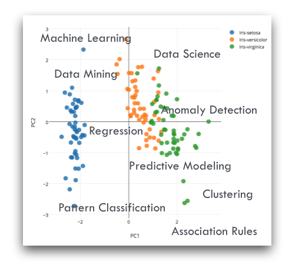

**A collection of tutorials and examples for solving and understanding machine learning and pattern classification tasks.**
 
 

 
 

# Machine Learning and Pattern Classification

 
 

- [Machine learning and pattern classification with scikit-learn](#machine-learning-and-pattern-classification-with-scikit-learn)
- [Pre-Processing](#pre-processing)
- [Techniques for Dimensionality Reduction](#techniques-for-dimensionality-reduction)
- [Techniques for Parameter Estimation](#techniques-for-parameter-estimation)
- [Statistical Pattern Recognition Examples](#statistical-pattern-recognition-examples)
- [Other Resources](#other-resources)
- [Dataset Collections](#links-to-useful-resources)
- [Free learning material](#Free-learning-material)

 
 
 

 

### Machine learning and pattern classification with scikit-learn 
[[back to top](#machine-learning-and-pattern-classification)]

- Entry Point: Data - Using Python's sci-packages to prepare data for Machine Learning tasks and other data analyses [[IPython nb](http://nbviewer.ipython.org/github/rasbt/python_reference/blob/master/tutorials/python_data_entry_point.ipynb)]

- An Introduction to simple linear supervised classification using `scikit-learn` [[IPython nb](http://nbviewer.ipython.org/github/rasbt/pattern_classification/blob/master/machine_learning/scikit-learn/scikit_linear_classification.ipynb)]

 
 
 

 

### Pre-processing

[[back to top](#machine-learning-and-pattern-classification)]

- About Feature Scaling: Standardization and Min-Max-Scaling (Normalization) [[IPython nb](http://nbviewer.ipython.org/github/rasbt/pattern_classification/blob/master/preprocessing/about_standardization_normalization.ipynb)]

 
 
 

 

 

### Techniques for Dimensionality Reduction
[[back to top](#machine-learning-and-pattern-classification)]

- **Projection**
	- Component Analyses
		- Linear Transformation
			- Principal Component Analysis (PCA) [[IPython nb](http://nbviewer.ipython.org/github/rasbt/pattern_classification/blob/master/dimensionality_reduction/projection/principal_component_analysis.ipynb)]
			- Linear Discriminant Analysis (LDA) [[IPython nb](http://nbviewer.ipython.org/github/rasbt/pattern_classification/blob/master/dimensionality_reduction/projection/linear_discriminant_analysis.ipynb)]

- **Feature Selection**
	- Sequential Feature Selection Algorithms [[IPython nb](http://nbviewer.ipython.org/github/rasbt/pattern_classification/blob/master/dimensionality_reduction/feature_selection/sequential_selection_algorithms.ipynb)]

 

 

### Techniques for Parameter Estimation
[[back to top](#machine-learning-and-pattern-classification)]

- **Parametric Techniques**
    - Introduction to the Maximum Likelihood Estimate (MLE) [[IPython nb](http://nbviewer.ipython.org/github/rasbt/pattern_classification/blob/master/parameter_estimation_techniques/maximum_likelihood_estimate.ipynb)]
    - How to calculate Maximum Likelihood Estimates (MLE) for different distributions [[IPython nb](http://nbviewer.ipython.org/github/rasbt/pattern_classification/blob/master/parameter_estimation_techniques/max_likelihood_est_distributions.ipynb)]
	
- **Non-Parametric Techniques**
	- Kernel density estimation via the Parzen-window technique [[IPython nb](http://nbviewer.ipython.org/github/rasbt/pattern_classification/blob/master/parameter_estimation_techniques/parzen_window_technique.ipynb)]
	- The K-Nearest Neighbor (KNN) technique 

- **Regression Analysis**
	- Linear Regression
		- Least-Squares fit [[IPython nb](http://nbviewer.ipython.org/github/rasbt/pattern_classification/blob/master/data_fitting/regression/linregr_least_squares_fit.ipynb)]
   
   - Non-Linear Regression

 

 

### Statistical Pattern Recognition Examples
[[back to top](#machine-learning-and-pattern-classification)]

- **Supervised Learning**
    	
    - Parametric Techniques
    	- Univariate Normal Density 
    		- Ex1: 2-classes, equal variances, equal priors [[IPython nb](http://nbviewer.ipython.org/github/rasbt/pattern_classification/blob/master/stat_pattern_class/supervised/parametric/1_stat_superv_parametric.ipynb)]
			- Ex2: 2-classes, different variances, equal priors [[IPython nb](http://nbviewer.ipython.org/github/rasbt/pattern_classification/blob/master/stat_pattern_class/supervised/parametric/2_stat_superv_parametric.ipynb)]
			- Ex3: 2-classes, equal variances, different priors [[IPython nb](http://nbviewer.ipython.org/github/rasbt/pattern_classification/blob/master/stat_pattern_class/supervised/parametric/3_stat_superv_parametric.ipynb)]
			- Ex4: 2-classes, different variances, different priors, loss function [[IPython nb](http://nbviewer.ipython.org/github/rasbt/pattern_classification/blob/master/stat_pattern_class/supervised/parametric/4_stat_superv_parametric.ipynb)]
			- Ex5: 2-classes, different variances, equal priors, loss function, cauchy distr. [[IPython nb](http://nbviewer.ipython.org/github/rasbt/pattern_classification/blob/master/stat_pattern_class/supervised/parametric/5_stat_superv_parametric.ipynb)]			
			
			
			
    	- Multivariate Normal Density
			- Ex5: 2-classes, different variances, equal priors, loss function [[IPython nb](http://nbviewer.ipython.org/github/rasbt/pattern_classification/blob/master/stat_pattern_class/supervised/parametric/5_stat_superv_parametric.ipynb)]
			- Ex7: 2-classes, equal variances, equal priors [[IPython nb](http://nbviewer.ipython.org/github/rasbt/pattern_classification/blob/master/stat_pattern_class/supervised/parametric/7_stat_superv_parametric.ipynb)]  		
    		
    - Non-Parametric Techniques

- **Unsupervised Learning**

 

 

## Other resources
[[back to top](#machine-learning-and-pattern-classification)]

- A collection of copy-and-paste ready LaTex equations [[Markdown](./resources/latex_equations.md)]

 
 

 

 

## Links to useful resources
[[back to top](#machine-learning-and-pattern-classification)]

#### [Dataset Collections](./resources/dataset_collections.md)

 
 

## Free learning material

[[back to top](#machine-learning-and-pattern-classification)]

#### [Free Machine Learning eBooks](./resources/machine_learning_ebooks.md)

